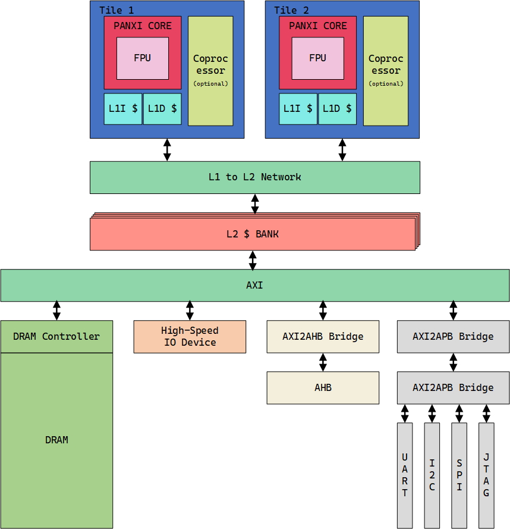

# PANXI-RV32

This is an experiment for  lab's members, aiming to design an RV32 SoC. In the future, we will continuously add the desired functions to it.

<!-- PROJECT SHIELDS -->

[![Contributors][contributors-shield]][contributors-url]
[![Forks][forks-shield]][forks-url]
[![Stargazers][stars-shield]][stars-url]
[![Issues][issues-shield]][issues-url]
[![MIT License][license-shield]][license-url]

<!-- PROJECT LOGO -->
<br />

<p align="center">
  <a href="https://github.com/JacoboJin/PANXI-RV32Core/">
    
  </a>

  <h3 align="center">PANXI-RV32</h3>
  <p align="center">
    A "perfect" readme document for you to start the project!
    <br />
    <a href="https://github.com/JacoboJin/PANXI-RV32Core"><strong>Explore the documentation of this project. »</strong></a>
    <br />
    <br />
    <a href="https://github.com/JacoboJin/PANXI-RV32Core">View Demo</a>
    ·
    <a href="https://github.com/JacoboJin/PANXI-RV32Core/issues">Report Bug</a>
    ·
    <a href="https://github.com/JacoboJin/PANXI-RV32Core/issues">Issue</a>
  </p>

</p>

<!-- PROJECT BODY -->
## Contents

- [PANXI-RV32](#panxi-rv32)
  - [Contents](#contents)
      - [PANXI SoC Arch](#panxi-soc-arch)
    - [File Directory](#file-directory)
    - [Version Control](#version-control)
    - [Author](#author)
    - [License](#license)

#### PANXI SoC Arch
  <a href="https://github.com/JacoboJin/PANXI-RV32Core/">
    
  </a>

### File Directory

```text
File Tree
├── /ReadMe-deps/
├── LICENSE
└── README.md
```

### Version Control

This project uses Git for version control. You can check the available versions in the repository.

### Author

_**@ Microelectronics R&D Center in Shanghai University**_

<!--
<p align="center">
  <a href="https://github.com/JacoboJin/PANXI-RV32Core/">
    
  </a>
</p>
-->
 *You can also check the list of contributors to see all the developers involved in this repo.*

### License

This project is licensed under the **MIT License**. For details, please refer to the [LICENSE](https://github.com/JacoboJin/PANXI-RV32Core/blob/main/LICENSE) file.

<!-- links -->
[your-project-path]: JacoboJin/PANXI-RV32Core
[contributors-shield]: https://img.shields.io/github/contributors/JacoboJin/PANXI-RV32Core.svg?style=flat-square
[contributors-url]: https://github.com/JacoboJin/PANXI-RV32Core/graphs/contributors
[forks-shield]: https://img.shields.io/github/forks/JacoboJin/PANXI-RV32Core.svg?style=flat-square
[forks-url]: https://github.com/JacoboJin/PANXI-RV32Core/network/members
[stars-shield]: https://img.shields.io/github/stars/JacoboJin/PANXI-RV32Core.svg?style=flat-square
[stars-url]: https://github.com/JacoboJin/PANXI-RV32Core/stargazers
[issues-shield]: https://img.shields.io/github/issues/JacoboJin/PANXI-RV32Core.svg?style=flat-square
[issues-url]: https://img.shields.io/github/issues/JacoboJin/PANXI-RV32Core.svg
[license-shield]: https://img.shields.io/github/license/JacoboJin/PANXI-RV32Core.svg?style=flat-square
[license-url]: https://github.com/JacoboJin/PANXI-RV32Core/blob/main/LICENSE
